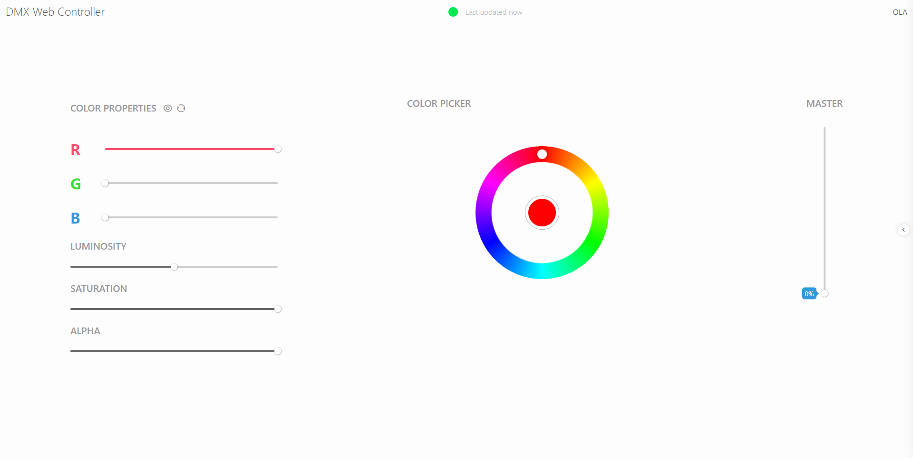
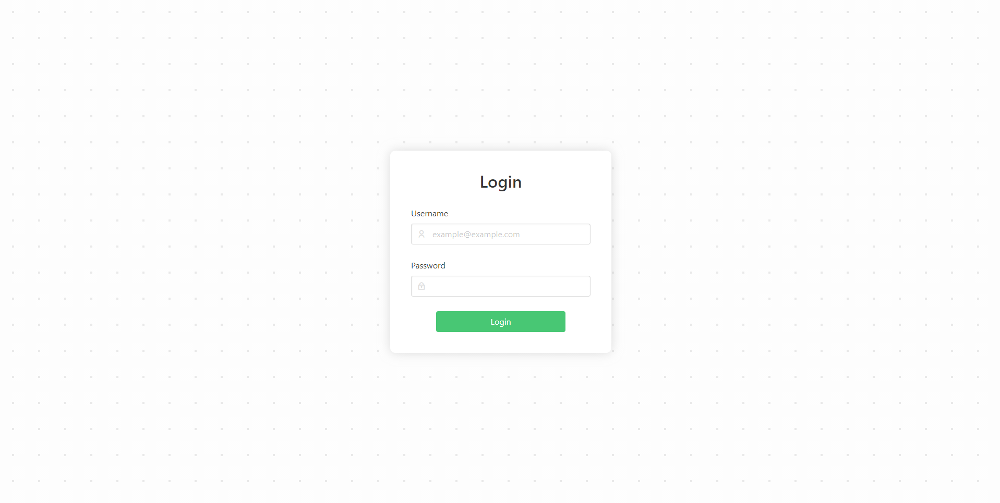

# DMX Web Controller

DMX Web Controller is a simple and easy to use web UI for changing the colors of DMX compatible lights. It features a realtime color picker, support for running custom scripts (also known as 'actions'), and username and password authentication.

\*Please note this project is built around [Open Lighting Architecture (OLA)](https://www.openlighting.org/). However, compatibility with other systems may be expanded upon in the feature.

## Dashboard

## Login

